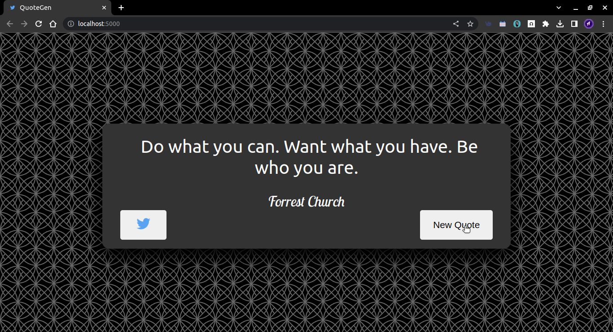

# QuoteGen - _Your daily dose of quotes to kick start your day_
### This heart of QuoteGen is that it generates random quotes from the database & retrieves it everytime we visit. This repo is still in construction process & it requires adding additional features like mailing some motivational quotes to the users on a specified interval which requires storing, authenticating, and login features. 

## To get this running this on you machine, 
1. Install nodejs from [here](https://nodejs.org/en)

2. After directing into this directory, fire up a terminal/command prompt and run **_npm init_**

3. Now all the necessary packages mentioned in the package.json file is installed

4. Run this **_npm run start_** command
  

5. Open up your browser and navigate to _localhost:5000_ and see the magic.
  

6. You can now play in this site

7. Share the quote that you linked by clicking this share to twitter icon
  

  

8. Generate a new quote by using a **New Quote** icon
  

 
